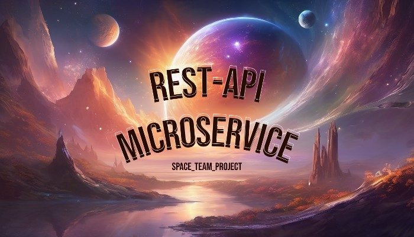

_____
This project is a rest-api microservice, which is implemented using: FastAPI, Tortoise ORM, Aerich, Postgres.
_____
###  Main functionality of the program: 
- Access to entities using the rest-api classic model: 
  data insertion, retrieval, deletion, update;
- Migration of Tortoise models to DBMS when running via Aerich;
- Availability of a test file to check the functionality of the program;
- The project is wrapped in docker.
###  Instructions for working with docker: 
The start settings for running containers are located in the docker-compose.yml file
The Dockerfile contains instructions for building service image.

#### Launch docker-compose:
1. docker-compose build
2. docker-compose up -d
#### Migration of DB:
3. docker exec -it Space_team_project_api aerich init -t database.TORTOISE_ORM  
4. docker exec -it Space_team_project_api aerich init-db
#### Stop and remove Docker-compose containers:
5. docker-compose down
#### View information about running Docker-compose processes and logs:
6. docker-compose ps
7. docker-compose logs
